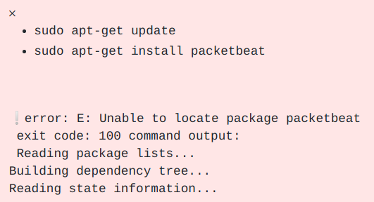
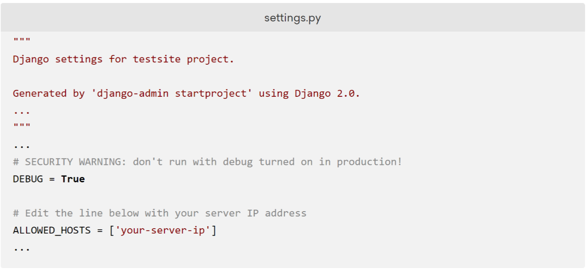
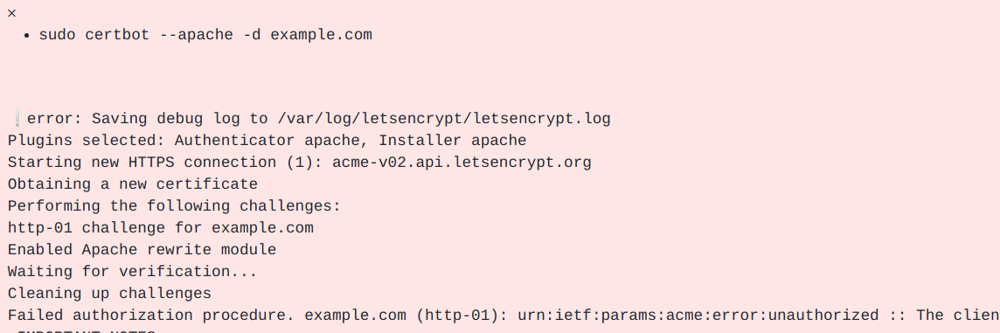

# Executing Online Tutorials

Our plan was to follow these steps:

- Find if tutorials can be executed naively (executing all code blocks without intervention)? If not, why?
- Find what tutorial instructions are made of? What different types of code blocks are  used?
- Does the executability of tutorials increase if we use human annotations to distinguish between different types of instructions? (Using Docable here.)

> Note: Docable is a tool we made to help with testing tutorials (or documentation). It supports custom annotations for selecting specific code blocks from the tutorial and executing them. The bullet points below is the list of supported annotations, and the yaml snippet shows test cases for an example tutorial.

```yml
tutorial_1.html:
    steps: 
        - run: "first go to tmp dir:"
        - file: "ROT13 service => ROT13.service"
        user: root
        - serve: "start it"
        - run:
            select: "install the unzip utility"
            input: "Do you want to continue? => yes"
        - run: "Then go to installation directory"
        persistent: p1
        - run: "download the file to the current directory:"
        persistent: p1
```

  - **run:** annotation allows selecting an snippet given a search text that exists in a paragraph above that snippet.
  - **file** annotation allos creating files. The left side of `=>` is a search text to find the snippet, and the right side of the `=>` is the path where the file needs to be created.
  - **serve** annotation allows executing long running processes. For example, starting a server in the background can be a use case for this selector. 
  - **user** annotation allows doing an action as the specified user of the environment. In the example below the file needs to be created using the `root` user.
  - **input** annotation allows responding to interactive prompts. The left side of `=>` is the prompt question and the right side of `=>` is the response for that prompt.
  - **persistent** annotation makes it possible to run the snippet in an interactive shell. As a result of running in an interactive shell, the current working directory, environment variables and everything else is preserved until the next time a persistent snippet runs with the same ID.

## Find if tutorials can be executed naively?

As the first step we wanted to show this is not a trivial problem. We already knew tutorials are often very complicated and we can't simply execute all the code blocks and finish the tutorial successfully. To show this, we executed 665 tutorials we found online and found about 75% of the tutorials got stuck because of interactive commands/prompts! 

Then, we found a large number of those cases were `apt-get install` commands that didn't include `-y` option. So we updated our script to automatically add this option to avoid getting a prompt when installing packages. This time, the number of tutorials that got stuck was reduced to 39%. This was the best we could achieve with a naive approach, so we started looking into the execution logs to find what is failing.


## Why not?

To answer why tutorials can't be executed naively, we looked at the exit codes from executing their code blocks:

| exit code | Count | Description                                                                         |
|-----------|-------|-------------------------------------------------------------------------------------|
| -         | 5382  | Unreachable code blocks                                                             |
| 0         | 3916  | Successful execution                                                                |
| 127       | 2393  | _command not found_ error                                                           |
| 1         | 2032  | Catchall for general errors                                                         |
| 100       | 269   | _Unable to locate package X as a result of running apt-get install_                 |
| timed out | 261   | Any command terminated after timeout (10 minutes)                                   |
| 5         | 201   | _Service X not foun, no such file or directory_ as a result of `systemctl` commands |

We found only 26% of code blocks executed successfully, 36% didn't get executed because the tutorials timed out, 16% of code blocks returned 127 exit code which shows a command not found error. 

So, the two biggest problems are: 

1. Interactive commands which make tutorials timeout.

2. Code blocks that show something other than commands (like content of a file), and need human interpretations to be used properly.


## What are different types of code blocks?

We categorized code blocks to 4 types:

- Content: content of a file.
- Output: output of a command.
- Command: the commands to be executed.
- Presentation: other information for the tutorial reader.

Each of these types can also have different attributes like _partially_ showing content of a file, and _using template values_ which should be updated by the reader. 

Given so many types of code blocks and their attributes, we must have some understanding of the content to be able to execute them.

## Can we execute tutorials if we use human annotations?

To answer this question, we wrote tests for 40 tutorials using Docable. Using Docable tests, we were able to successfully execute 50% of the code blocks (compared to 26% in the previous experiment), and none of the tutorials timed out. The execution success rate increased but it was still very low. So, we manually checked all of the failures and found some common reasons for them:


- Some tutorials make assumptions about the environment, for example they assume apt-get cache is up to data, so they don't run apt-get update command. Or they assume a dependency like nodejs is installed. (In some cases tutorials include link(s) to another tutorials as dependencies, but it is not clear how long it will take to follow those tutorials and whether they will have their own dependencies or not)



- We found cases that use ambiguity in the code blocks so we couldn't really automate them. For example this content block which uses "..." to summarize parts of the file.



- In some cases we even found some inconsistency in the instructions. For example we saw a tutorial instructed to install version "0.9-beta.3" but they had a code block showing the --version is "0.9-beta.2".

- Some of the code blocks that show output of commands include unique values like PID, IP address, date and time. So they are guaranteed to not match with the output we get.

- Some of the links in the tutorials were broken and as a result some steps like `wget` failed.

- Tutorials may depend on online services like GitHub, a registered domain, or multiple servers so they can't be automatically executed.


